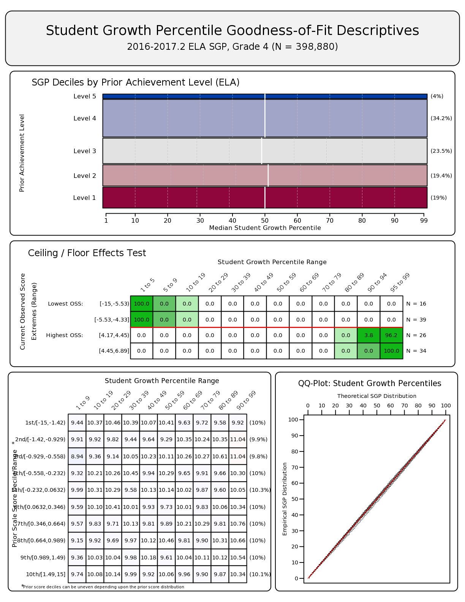
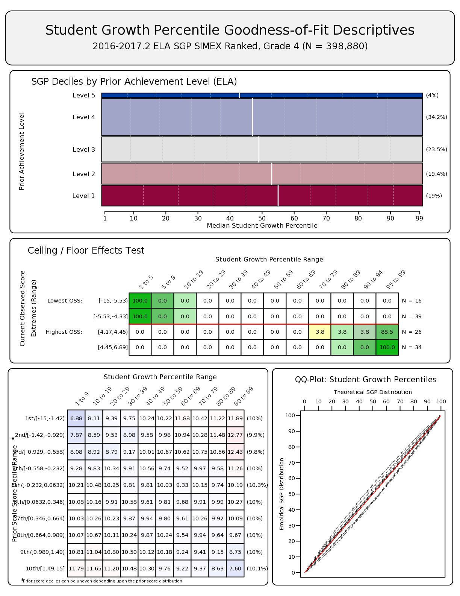
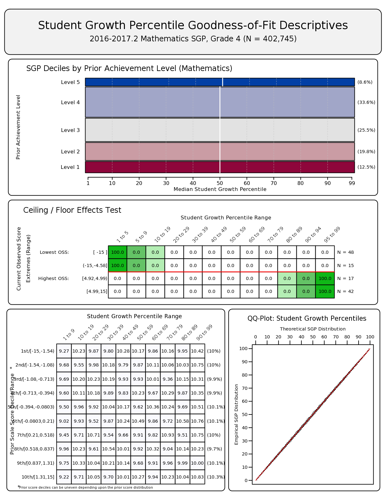
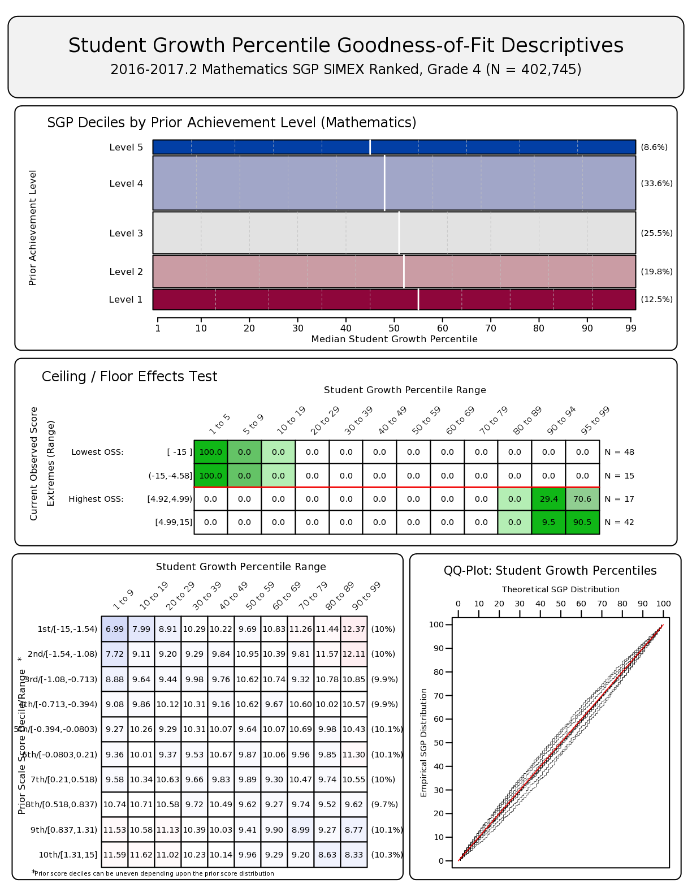
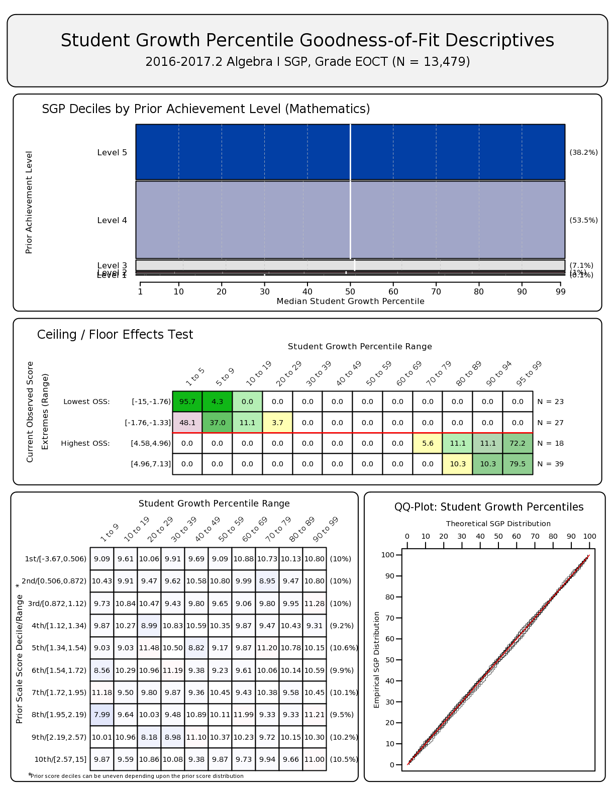
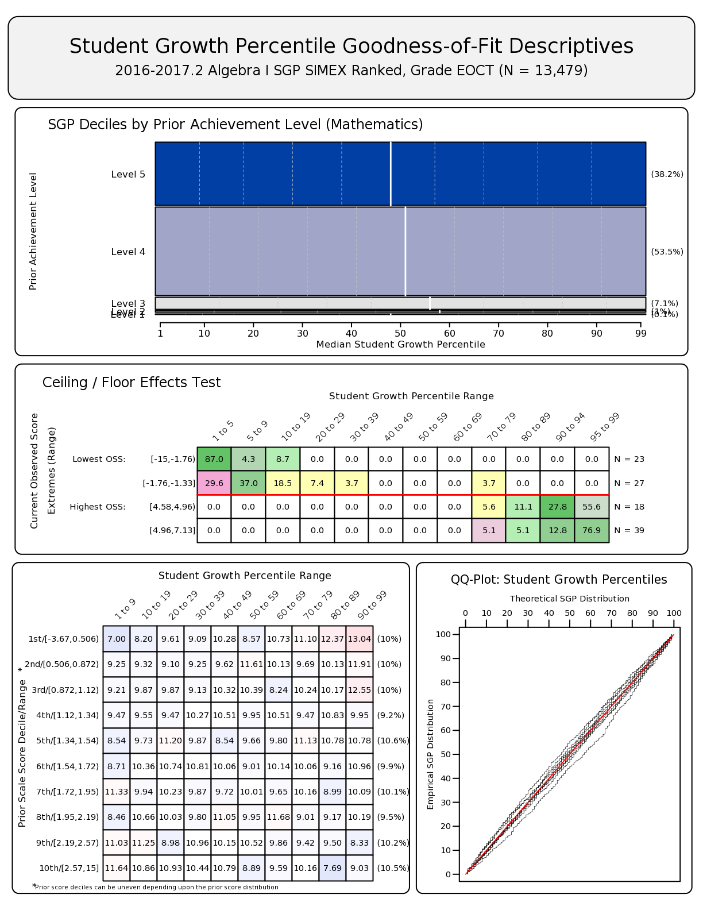
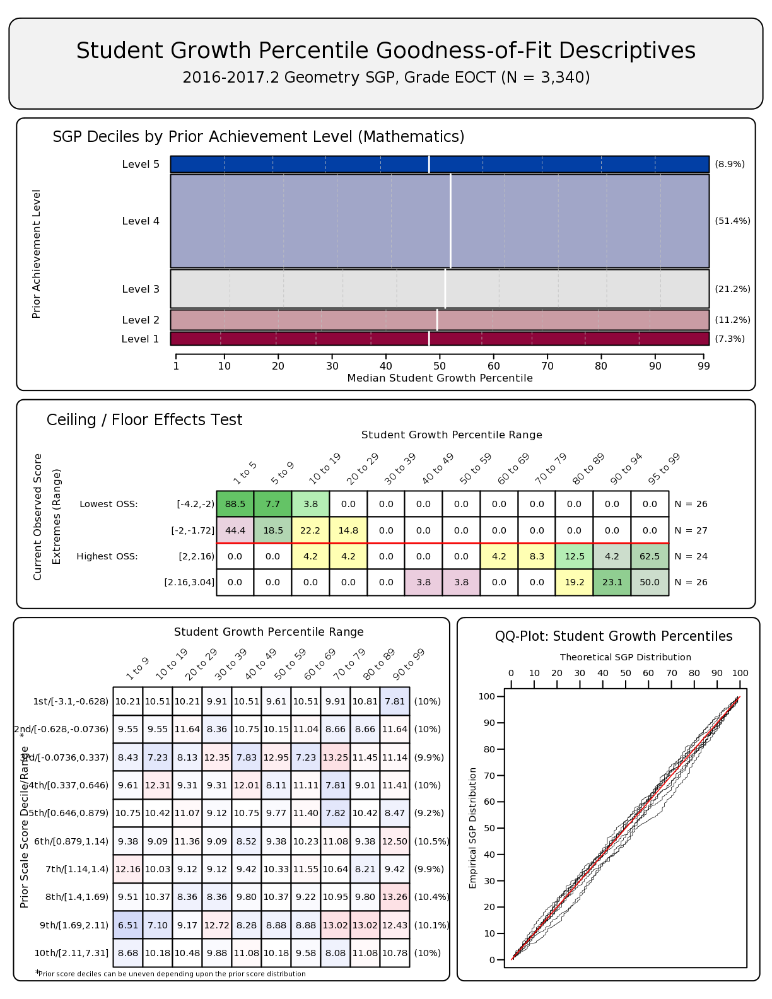
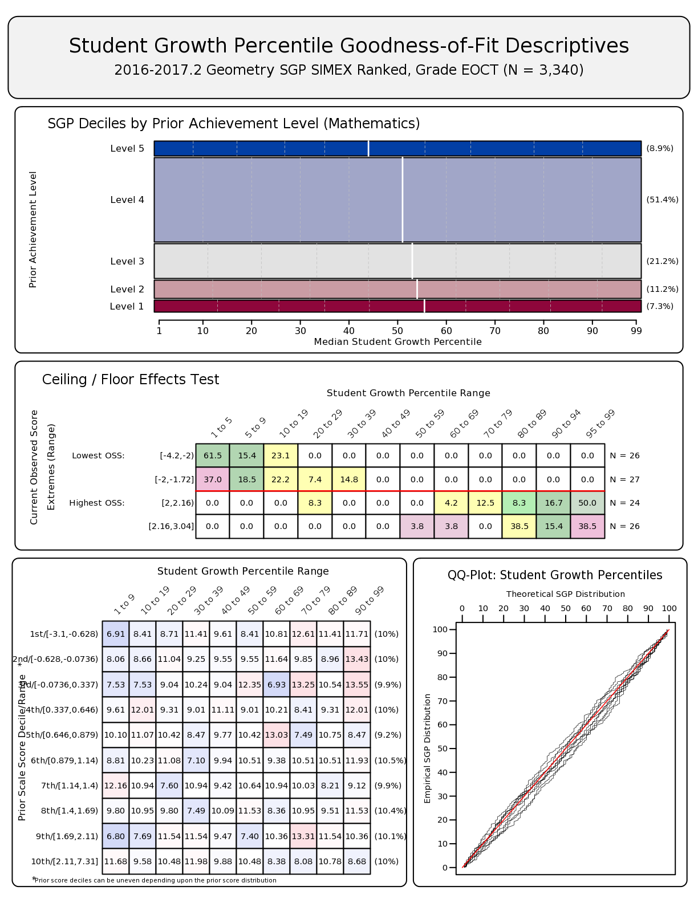
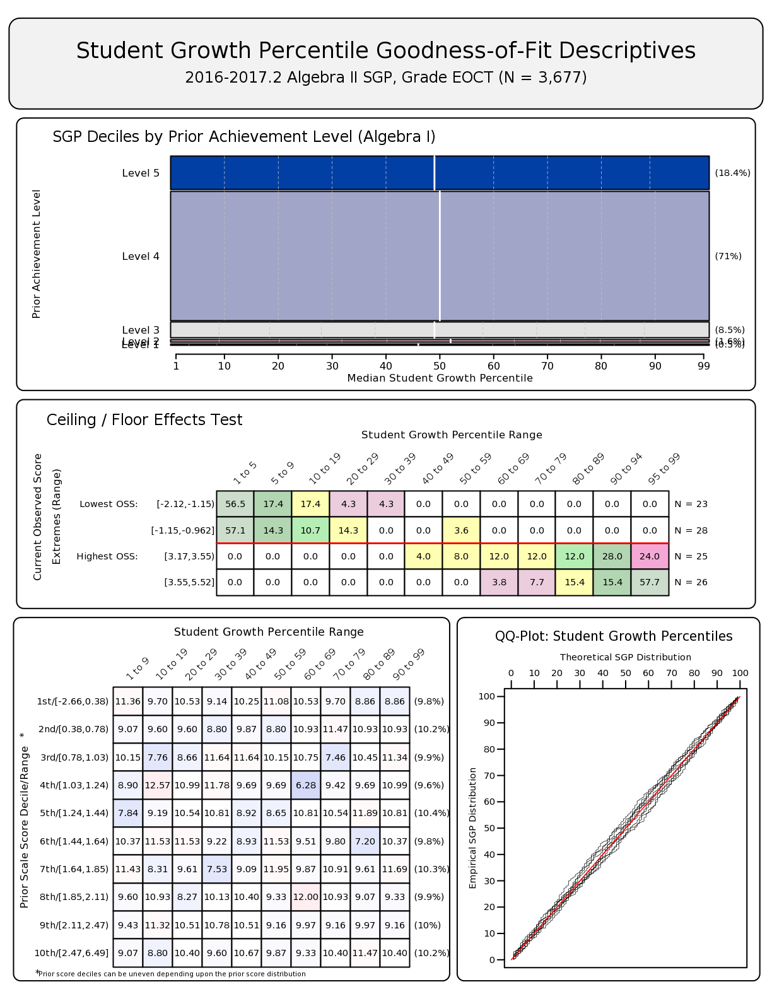
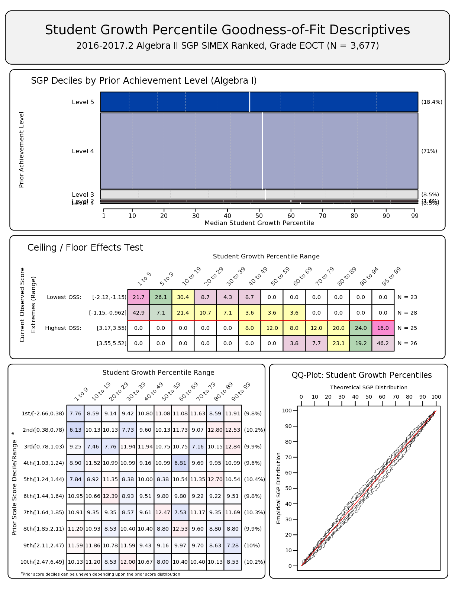

<!--SGPreport-->

<!-- Appendix A - Model Fit Plots -->

```{r, echo=FALSE, warning=FALSE, message=FALSE, include=FALSE}
  require(SGP)
  require(Gmisc)
	require(data.table)

  knitr::opts_chunk$set(cache.path = "_cache/Appendix_A_2017")

  ##  Set Table, Figure and Equation Counters
  options(table_counter=FALSE)
  options(table_number=0)
  options(table_counter_str = "<strong>Table A.%s:</strong> ")
  options("fig_caption_no"=0)
  options(fig_caption_no_sprintf = "**Fig. A.%s:**   %s")
	options("fig_caption_no_roman"=FALSE)
	options("equation_counter" = 0)
```

# Student Growth Percentile Fit Plots

A goodness of fit plot is produced for each unique Spring 2017 Student Growth Percentile (SGP) analysis.  All fit plots will contain at least four panels.  Each panel is a different depiction of the distribution of the SGPs calculated in that analysis relative to the students' prior or current achievement (i.e. the test scores used as the independent and dependent variables in the model).

The top panel is a mosaic plot that shows the percentage of students that fall into each prior proficiency level, and the location of the 10<sup>th</sup> through 90<sup>th</sup> quantiles of the SGP distribution represented as dashed white lines (with the exception of the solid white line for the median/50<sup>th</sup> percentile).  Ideally the median SGP will be at or near 50 for all prior achievement level groups.  The top panel is excluded when students' prior achievement level data is unavailable.

The "Ceiling/Floor Effects Test" panel helps identify problems in SGP estimation at the Highest and Lowest Obtainable/Observed Scale Scores (HOSS and LOSS).  Appendix C provides a more detailed description of ceiling and floor effects and their causes.  The table of values shows whether the current year scores at both extremes yield expected SGP values.  The expectation is that the majority of SGPs for students scoring at or near the LOSS will be low (preferably less than 5 and not higher than 20), and that SGPs for students scoring at or near the HOSS will be high (preferably higher than 95 and not less than 80).  Because few students may score *exactly* at the HOSS/LOSS, the top/bottom 50 students are selected and any student scoring within their range of scores are selected for inclusion in these tables. Consequently, there may be a range of scores at the HOSS/LOSS rather than a single score, and there may be more than 50 students included in the HOSS/LOSS row if the 50 students at the extremes only contain the single HOSS/LOSS score.

The "Student Growth Percentile Range" panel at bottom left shows the empirical distribution of SGPs given prior scale score deciles in the form of a 10 by 10 cell grid.  Percentages of student growth percentiles between the 10<sup>th</sup>, 20<sup>th</sup>, 30<sup>th</sup>, 40<sup>th</sup>, 50<sup>th</sup>, 60<sup>th</sup>, 70<sup>th</sup>, 80<sup>th</sup>, and 90<sup>th</sup> percentiles were calculated based upon the empirical decile of the cohort's prior year scaled score distribution^[The total students in each analysis varies depending on grade and subject, and prior score deciles are based only on scores for students used in the SGP calculations.]. Deviations from perfect fit are indicated by red and blue shading. The further above 10 the darker the red, and the further below 10 the darker the blue. A more detailed discussion about the reasons for and implications of model misfit can be found in the "Goodness of Fit" section of the 2017 PARCC Student Growth Model report.

The bottom right panel of each plot is a [Q-Q plot](https://en.wikipedia.org/wiki/Q%E2%80%93Q_plot) which compares the observed distribution of SGPs with the theoretical (uniform) distribution.  An ideal plot here will show black step function lines that do not deviate from the ideal, red line which traces the 45 degree angle of perfect fit.

Goodness of fit plots for SIMEX measurement error corrected models are also presented here for each analysis.  The expectations in the SGP distribution panels are different for these models, where lower attaining students will receive higher SGPs and vice versa.  This typically shifts the median lines in the mosaic plot panel and causes a red shift (more SGPs than expected) in the upper-right and lower-left quadrants of the "Student Growth Percentile Range" panel.

<!-- HTML_Start -->
<!-- LaTeX_Start 
\clearpage 
LaTeX_End -->


# End-of-Grade Analyses

## ELA

<!-- HTML_Start -->
##### `r figCapNo("Goodness of Fit Plot for Grade 4 ELA, 2017 (Uncorrected).")` 


<!-- LaTeX_Start 
\begin{figure}[H]
  \begin{subfigure}[b]{0.9\textwidth}
    \includegraphics[width=\textwidth]{../img/Appendices/Goodness_of_Fit/ELA.2016_2017.2/2016_2017-2_ELA_4;2015_2016-2_ELA_3.png}
  \end{subfigure}
\caption{Goodness of Fit Plot for Grade 4 ELA, 2017 (Uncorrected).}
\end{figure}

\pagebreak
LaTeX_End -->

##### `r figCapNo("Goodness of Fit Plot for Grade 4 ELA, 2017 (SIMEX Corrected).")` 



```{r, comment=NA, results='asis', highlight=NA, echo=FALSE, warning=FALSE, message=FALSE, goFit_EOG_ELA}
tmp.files <- unique(gsub(".png|.pdf", "", list.files("../img/Appendices/Goodness_of_Fit/ELA.2016_2017.2.RANKED_SIMEX")))

if (any(grepl("[.]", tmp.files))) {
	invisible(file.rename(paste0("../img/Appendices/Goodness_of_Fit/ELA.2016_2017.2/", tmp.files, ".png"),
							paste0("../img/Appendices/Goodness_of_Fit/ELA.2016_2017.2/", gsub("[.]", "-", tmp.files), ".png")))
	invisible(file.rename(paste0("../img/Appendices/Goodness_of_Fit/ELA.2016_2017.2.RANKED_SIMEX/", tmp.files, ".png"),
							paste0("../img/Appendices/Goodness_of_Fit/ELA.2016_2017.2.RANKED_SIMEX/", gsub("[.]", "-", tmp.files), ".png")))
}

tmp.files <- gsub("[.]", "-", tmp.files)[-3]
	
for (gof in tmp.files[c(3:7, 1,2)]) {
	tmp.seq <- strsplit(gof, ";")[[1]]
	tmp.grd <- gsub("2016_2017-2_ELA_", "", tmp.seq[1])
	
cat(paste("
##### ", figCapNo(paste0("Goodness of Fit Plot for Spring 2017 Grade ", tmp.grd, " ELA (Uncorrected).")), "


", sep=""))

cat(paste("
##### ", figCapNo(paste0("Goodness of Fit Plot for Spring 2017 Grade ", tmp.grd, " ELA (SIMEX Corrected).")), "


", sep=""))

cat('<!-- HTML_Start -->
<!-- LaTeX_Start 
\\clearpage 
LaTeX_End -->')
}
```


## Mathematics

<!-- HTML_Start -->
##### `r figCapNo("Goodness of Fit Plot for Grade 4 Mathematics, 2017 (Uncorrected).")` 


<!-- LaTeX_Start 
\begin{figure}[H]
  \begin{subfigure}[b]{0.9\textwidth}
    \includegraphics[width=\textwidth]{../img/Appendices/Goodness_of_Fit/MATHEMATICS.2016_2017.2/2016_2017-2_MATH_4;2015_2016-2_MATH_3.png}
  \end{subfigure}
\caption{Goodness of Fit Plot for Grade 4 Mathematics, 2017 (Uncorrected).}
\end{figure}

\pagebreak
LaTeX_End -->


##### `r figCapNo("Goodness of Fit Plot for Grade 4 Mathematics, Spring 2017 (SIMEX Corrected).")` 


```{r, comment=NA, results='asis', highlight=NA, echo=FALSE, warning=FALSE, message=FALSE, goFit_EOG_Math}
tmp.files <- unique(gsub(".png|.pdf", "", list.files("../img/Appendices/Goodness_of_Fit/MATHEMATICS.2016_2017.2.RANKED_SIMEX")))

if (any(grepl("[.]", tmp.files))) {
	invisible(file.rename(paste0("../img/Appendices/Goodness_of_Fit/MATHEMATICS.2016_2017.2/", tmp.files, ".png"),
							paste0("../img/Appendices/Goodness_of_Fit/MATHEMATICS.2016_2017.2/", gsub("[.]", "-", tmp.files), ".png")))
	invisible(file.rename(paste0("../img/Appendices/Goodness_of_Fit/MATHEMATICS.2016_2017.2.RANKED_SIMEX/", tmp.files, ".png"),
							paste0("../img/Appendices/Goodness_of_Fit/MATHEMATICS.2016_2017.2.RANKED_SIMEX/", gsub("[.]", "-", tmp.files), ".png")))
}

tmp.files <- gsub("[.]", "-", tmp.files)[-1]
	
for (gof in tmp.files) {
	tmp.seq <- strsplit(gof, ";")[[1]]
	tmp.grd <- gsub("2016_2017-2_MATH_", "", tmp.seq[1])
	
cat(paste("
##### ", figCapNo(paste0("Goodness of Fit Plot for Spring 2017 Grade ", tmp.grd, " Mathematics (Uncorrected).")), "


", sep=""))

cat(paste("
##### ", figCapNo(paste0("Goodness of Fit Plot for Spring 2017 Grade ", tmp.grd, " Mathematics (SIMEX Corrected).")), "


", sep=""))

cat('<!-- HTML_Start -->
<!-- LaTeX_Start 
\\clearpage 
LaTeX_End -->')
}
```


# End-of-Course Analyses (by Course Progression)


##  Algebra I

<!-- HTML_Start -->
##### `r figCapNo("Goodness of Fit Plot for Spring 2017 Algebra I (Priors: Spring 2016 Math Grade 7, Spring 2015 Math Grade 6 - Uncorrected).")` 


<!-- LaTeX_Start 
\begin{figure}[H]
  \begin{subfigure}[b]{0.9\textwidth}
    \includegraphics[width=\textwidth]{../img/Appendices/Goodness_of_Fit/ALGEBRA_I.2016_2017.2/2016_2017-2_ALGEBRA_I_EOCT;2015_2016-2_MATH_6;2014_2015-2_MATH_5.png}
  \end{subfigure}
\caption{Goodness of Fit Plot for Spring 2017 Algebra I (Priors: Spring 2016 Math Grade 7, Spring 2015 Math Grade 6 - Uncorrected).}
\end{figure}

\pagebreak
LaTeX_End -->

##### `r figCapNo("Goodness of Fit Plot for Spring 2017 Algebra I (Priors: Spring 2016 Math Grade 7, Spring 2015 Math Grade 6 - SIMEX Corrected).")`


```{r, comment=NA, results='asis', highlight=NA, echo=FALSE, warning=FALSE, message=FALSE, goFit_Alg1}
tmp.files <- unique(gsub(".png|.pdf", "", list.files("../img/Appendices/Goodness_of_Fit/ALGEBRA_I.2016_2017.2.RANKED_SIMEX")))

if (any(grepl("[.]", tmp.files))) {
	invisible(file.rename(paste0("../img/Appendices/Goodness_of_Fit/ALGEBRA_I.2016_2017.2/", tmp.files, ".png"),
							paste0("../img/Appendices/Goodness_of_Fit/ALGEBRA_I.2016_2017.2/", gsub("[.]", "-", tmp.files), ".png")))
	invisible(file.rename(paste0("../img/Appendices/Goodness_of_Fit/ALGEBRA_I.2016_2017.2.RANKED_SIMEX/", tmp.files, ".png"),
							paste0("../img/Appendices/Goodness_of_Fit/ALGEBRA_I.2016_2017.2.RANKED_SIMEX/", gsub("[.]", "-", tmp.files), ".png")))
}

tmp.files <- gsub("[.]", "-", tmp.files)[-2]

for (gof in tmp.files[c(2,3,1)]) {
tmp.priors <- paste(sapply(strsplit(gof, ";")[[1]][-1], function(f) capwords(f, special.words =c("II", "ELA", "EOCT"))), collapse=", ")

tmp.priors <- gsub("2014 2015-2 ", "Spring 2015 ", tmp.priors)
tmp.priors <- gsub("2015 2016-2 ", "Spring 2016 ", tmp.priors)
tmp.priors <- gsub("2016 2017-1 ", "Fall 2016 ", tmp.priors)
tmp.priors <- gsub(" EOCT", "", tmp.priors)
tmp.priors <- gsub(" 8", " Grade 8", tmp.priors)
tmp.priors <- gsub(" 7", " Grade 7", tmp.priors)
tmp.priors <- gsub(" 6", " Grade 6", tmp.priors)
	
cat(paste("
##### ", figCapNo(paste0("Goodness of Fit Plot for Spring 2017 Algebra I (Priors: ", tmp.priors, " - Uncorrected).")), "


", sep=""))

cat(paste("
##### ", figCapNo(paste0("Goodness of Fit Plot for Spring 2017 Algebra I (Priors: ", tmp.priors, " - SIMEX Corrected).")), "


", sep=""))

cat('<!-- HTML_Start -->
<!-- LaTeX_Start 
\\clearpage 
LaTeX_End -->')
}
```


##  Geometry

<!-- HTML_Start -->
##### `r figCapNo("Goodness of Fit Plot for Spring 2017 Geometry (Priors: Spring 2016 Math Grade 8, Spring 2015 Math Grade 7 - Uncorrected).")` 


<!-- LaTeX_Start 
\begin{figure}[H]
  \begin{subfigure}[b]{0.9\textwidth}
    \includegraphics[width=\textwidth]{../img/Appendices/Goodness_of_Fit/GEOMETRY.2016_2017.2/2016_2017-2_GEOMETRY_EOCT;2015_2016-2_MATH_8;2014_2015-2_MATH_7.png}
  \end{subfigure}
\caption{Goodness of Fit Plot for Spring 2017 Geometry (Priors: Spring 2016 Math Grade 8, Spring 2015 Math Grade 7 - Uncorrected).}
\end{figure}

\pagebreak
LaTeX_End -->

##### `r figCapNo("Goodness of Fit Plot for Spring 2017 Geometry (Priors: Spring 2016 Math Grade 8, Spring 2015 Math Grade 7 - SIMEX Corrected).")` 



```{r, comment=NA, results='asis', highlight=NA, echo=FALSE, warning=FALSE, message=FALSE, goFit_Geom}
tmp.files <- unique(gsub(".png|.pdf", "", list.files("../img/Appendices/Goodness_of_Fit/GEOMETRY.2016_2017.2.RANKED_SIMEX")))

if (any(grepl("[.]", tmp.files))) {
	invisible(file.rename(paste0("../img/Appendices/Goodness_of_Fit/GEOMETRY.2016_2017.2/", tmp.files, ".png"),
							paste0("../img/Appendices/Goodness_of_Fit/GEOMETRY.2016_2017.2/", gsub("[.]", "-", tmp.files), ".png")))
	invisible(file.rename(paste0("../img/Appendices/Goodness_of_Fit/GEOMETRY.2016_2017.2.RANKED_SIMEX/", tmp.files, ".png"),
							paste0("../img/Appendices/Goodness_of_Fit/GEOMETRY.2016_2017.2.RANKED_SIMEX/", gsub("[.]", "-", tmp.files), ".png")))
}

tmp.files <- gsub("[.]", "-", tmp.files)[1:4]

for (gof in tmp.files) {
tmp.priors <- paste(sapply(strsplit(gof, ";")[[1]][-1], function(f) capwords(f, special.words =c("II", "ELA", "EOCT"))), collapse=", ")

tmp.priors <- gsub("2014 2015-2 ", "Spring 2015 ", tmp.priors)
tmp.priors <- gsub("2015 2016-2 ", "Spring 2016 ", tmp.priors)
tmp.priors <- gsub("2016 2017-1 ", "Fall 2016 ", tmp.priors)
tmp.priors <- gsub(" EOCT", "", tmp.priors)
tmp.priors <- gsub(" 8", " Grade 8", tmp.priors)
tmp.priors <- gsub(" 7", " Grade 7", tmp.priors)
tmp.priors <- gsub(" 6", " Grade 6", tmp.priors)
	
cat(paste("
##### ", figCapNo(paste0("Goodness of Fit Plot for Spring 2017 Geometry (Priors: ", tmp.priors, " - Uncorrected).")), "


", sep=""))

cat(paste("
##### ", figCapNo(paste0("Goodness of Fit Plot for Spring 2017 Geometry (Priors: ", tmp.priors, " - SIMEX Corrected).")), "


", sep=""))

cat('<!-- HTML_Start -->
<!-- LaTeX_Start 
\\clearpage 
LaTeX_End -->')
}
```


##  Algebra II

<!-- HTML_Start -->
##### `r figCapNo("Goodness of Fit Plot for Spring 2017 Algebra II (Priors: Spring 2016 Algebra I, Spring 2015 Math Grade 7 - Uncorrected).")` 


<!-- LaTeX_Start 
\begin{figure}[H]
  \begin{subfigure}[b]{0.9\textwidth}
    \includegraphics[width=\textwidth]{../img/Appendices/Goodness_of_Fit/ALGEBRA_II.2016_2017.2.RANKED_SIMEX/2016_2017-2_ALGEBRA_II_EOCT;2015_2016-2_ALGEBRA_I_EOCT;2014_2015-2_MATH_7.png}
  \end{subfigure}
\caption{Goodness of Fit Plot for Spring 2017 Algebra II (Priors: Spring 2016 Algebra I, Spring 2015 Math Grade 7 - Uncorrected).}
\end{figure}

\pagebreak
LaTeX_End -->

##### `r figCapNo("Goodness of Fit Plot for Spring 2017 Algebra II (Priors: Spring 2016 Algebra I, Spring 2015 Math Grade 7 - SIMEX Corrected).")` 


```{r, comment=NA, results='asis', highlight=NA, echo=FALSE, warning=FALSE, message=FALSE, goFit_Alg2}
tmp.files <- unique(gsub(".png|.pdf", "", list.files("../img/Appendices/Goodness_of_Fit/ALGEBRA_II.2016_2017.2.RANKED_SIMEX")))

if (any(grepl("[.]", tmp.files))) {
	invisible(file.rename(paste0("../img/Appendices/Goodness_of_Fit/ALGEBRA_II.2016_2017.2/", tmp.files, ".png"),
							paste0("../img/Appendices/Goodness_of_Fit/ALGEBRA_II.2016_2017.2/", gsub("[.]", "-", tmp.files), ".png")))
	invisible(file.rename(paste0("../img/Appendices/Goodness_of_Fit/ALGEBRA_II.2016_2017.2.RANKED_SIMEX/", tmp.files, ".png"),
							paste0("../img/Appendices/Goodness_of_Fit/ALGEBRA_II.2016_2017.2.RANKED_SIMEX/", gsub("[.]", "-", tmp.files), ".png")))
}

tmp.files <- gsub("[.]", "-", tmp.files)[-1]

for (gof in tmp.files) {
tmp.priors <- paste(sapply(strsplit(gof, ";")[[1]][-1], function(f) capwords(f, special.words =c("II", "ELA", "EOCT"))), collapse=", ")

tmp.priors <- gsub("2014 2015-2 ", "Spring 2015 ", tmp.priors)
tmp.priors <- gsub("2015 2016-2 ", "Spring 2016 ", tmp.priors)
tmp.priors <- gsub("2016 2017-1 ", "Fall 2016 ", tmp.priors)
tmp.priors <- gsub(" EOCT", "", tmp.priors)
tmp.priors <- gsub(" 8", " Grade 8", tmp.priors)
tmp.priors <- gsub(" 7", " Grade 7", tmp.priors)
tmp.priors <- gsub(" 6", " Grade 6", tmp.priors)

cat(paste("
##### ", figCapNo(paste0("Goodness of Fit Plot for Spring 2017 Algebra II (Priors: ", tmp.priors, " - Uncorrected).")), "


", sep=""))

cat(paste("
##### ", figCapNo(paste0("Goodness of Fit Plot for Spring 2017 Algebra II (Priors: ", tmp.priors, " - SIMEX Corrected).")), "


", sep=""))

cat('<!-- HTML_Start -->
<!-- LaTeX_Start 
\\clearpage 
LaTeX_End -->')
}
```

